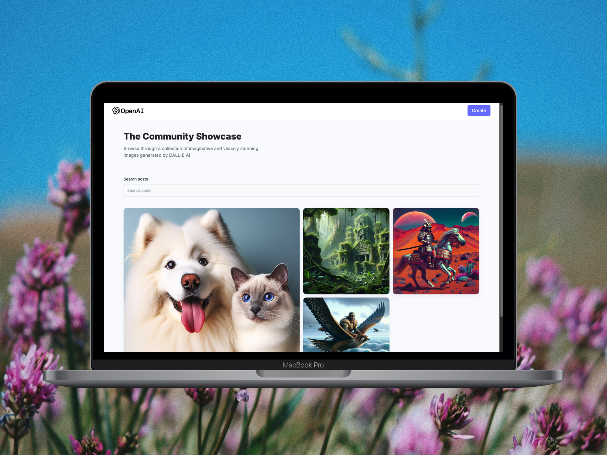
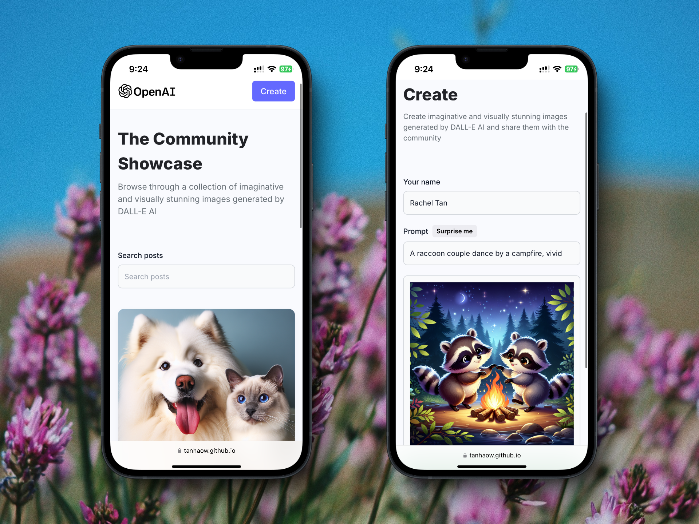

# 🌟 OpenAI DALL-E Image Generation App

Welcome to DALL-E Clone, a full-stack web app powered by OpenAI's DALL-E API to generate stunning AI-driven images. This app is a playground for AI and creativity, where your words turn into art. 🧑‍🎨
Build, share, and explore a community of AI-generated artwork—all in a sleek, responsive design. Whether you're an AI enthusiast or just curious, this platform lets you dive into the magic of image generation easily! 🎨✨





## 🌐 Demo
Here is a working live demo: 
https://tanhaow.github.io/OpenAI-Image-Generation-App/

## 🛠️ Technologies Used
- Frontend: React, Vite, Tailwind CSS
- Backend: Node.js, Express
- Database: MongoDB
- Image Cloud Storage: Cloudinary
- AI Image Generation: OpenAI DALL-E API



## 📝 What It's All About

I built this project with the motivation to make interacting with AI image generation easy and fun! Many people don't often try platforms like Midjourney or DALL-E, so I wanted to create a user-friendly way for everyone to explore the magic of AI. Therefore, my goal was to simplify interacting with DALL-E and build a community around it. 🪄

As a result, this DALL-E Clone web app streamlines the process of generating AI images and provides a platform for sharing and discovering AI-generated artwork! 🎨✨

### ✨ New Features

- Generate AI images using DALL-E API
- Share generated images with the community
- View and download community-shared images
- Responsive design for various screen sizes

## 📖 Table of Contents
- [🌟 OpenAI DALL-E Image Generation App](#-openai-dall-e-image-generation-app)
  - [🌐 Demo](#-demo)
  - [🛠️ Technologies Used](#️-technologies-used)
  - [📝 What It's All About](#-what-its-all-about)
    - [✨ New Features](#-new-features)
  - [📖 Table of Contents](#-table-of-contents)
  - [✨ Features](#-features)
  - [🛠️ Setup Project](#️-setup-project)
    - [🍴 Prerequisites](#-prerequisites)
    - [🚀 Installation](#-installation)
  - [🔍 Usage](#-usage)
  - [🔒 Environment Variables](#-environment-variables)
  - [🤝 Contributing](#-contributing)
  - [📄 License](#-license)

## ✨ Features

- Generate AI images using DALL-E API
- Share generated images with the community
- View and download community-shared images
- Responsive design for various screen sizes

## 🛠️ Setup Project
### 🍴 Prerequisites

- [Node.js](https://nodejs.org/)
- [npm](https://www.npmjs.com/)
- [MongoDB](https://www.mongodb.com/)
- [Cloudinary account](https://cloudinary.com/)
- [OpenAI API key](https://openai.com/)


### 🚀 Installation
1. Clone the repository
```bash
git clone https://github.com/yourusername/dalle-clone.git
cd dalle-clone
```

2. Install dependencies for both client and server
```bash
cd client
npm install
cd ../server
npm install
```

3. Set up environment variables (see [Environment Variables](#environment-variables) section)

4. Start the back-end
```bash
cd server
npm start
```

5. Start the front-end
```bash
cd client
npm run dev
```

## 🔍 Usage
After starting both the client and server, navigate to `http://localhost:5173` (or a similar address, find in your terminal log) in your web browser. You can create new AI-generated images by providing prompts, and view or share images created by the community.


## 🔒 Environment Variables

In the `server` directory, create a `.env` file and add the following values:
```bash
MONGODB_URL=your_mongodb_connection_string
OPENAI_API_KEY=your_openai_api_key
CLOUDINARY_CLOUD_NAME=your_cloudinary_cloud_name
CLOUDINARY_API_KEY=your_cloudinary_api_key
CLOUDINARY_API_SECRET=your_cloudinary_api_secret
```

## 🤝 Contributing

Contributions are welcome! Please feel free to submit a Pull Request.

1. Fork the repository
2. Create your feature branch (`git checkout -b feature/AmazingFeature`)
3. Commit your changes (`git commit -m 'Add some AmazingFeature'`)
4. Push to the branch (`git push origin feature/AmazingFeature`)
5. Open a Pull Request


## 📄 License
This project is licensed under the MIT License - see the [LICENSE](LICENSE) file for details.
